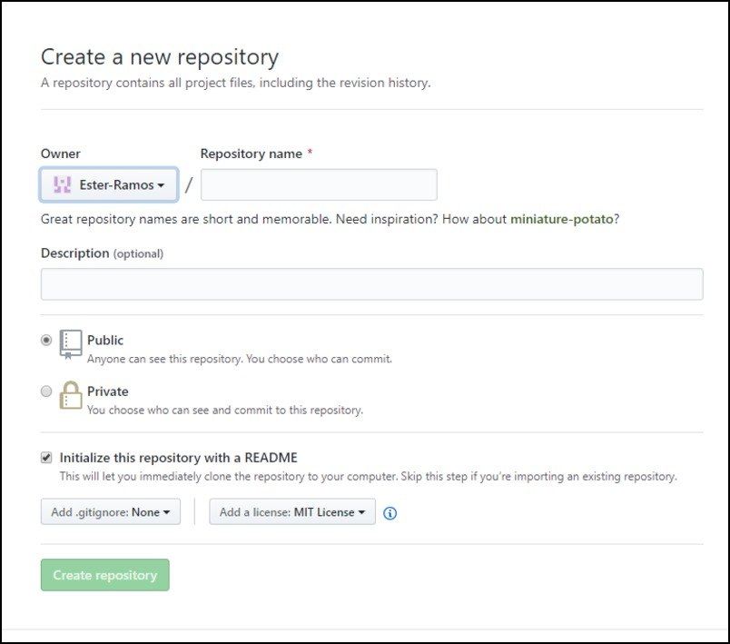
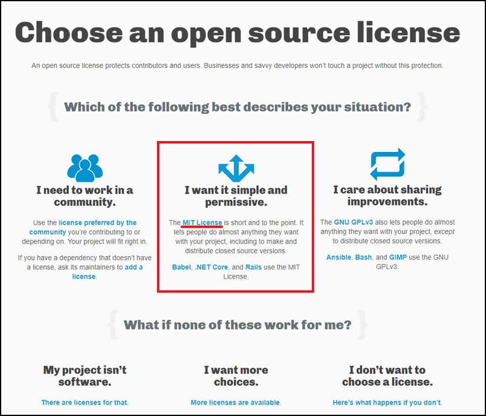
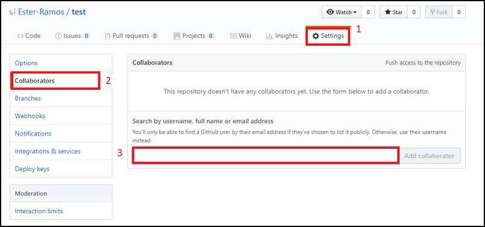

# Creating a repository (one person)

3. Pick a teammate in your group to create a repository in Github. Make sure it has:

  - an appropriate name
  - a description
  - public access
  - a .gitignore (pretend this will be a Python project and choose Python)
  - a README
  - a LICENSE (MIT is good for now)

4. Now the new repository owner should add the rest of your teammates as collaborators on the repository. Go to the repository settings and add them by Github username. This will email everyone an invitation to collaborate - accept it.

