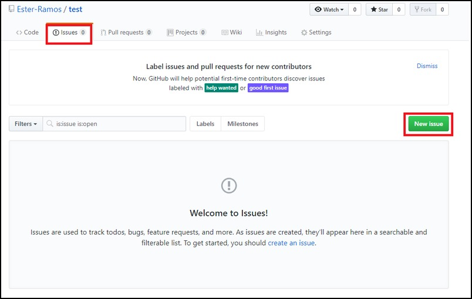

# Creating issues (everyone)

6. Create an issue based on a question (from a provided list, see below).

### Examples 

* What is your favourite food? 
* Where were you born? 
* What is your professional/education background?
* Why did you join this workshop?

