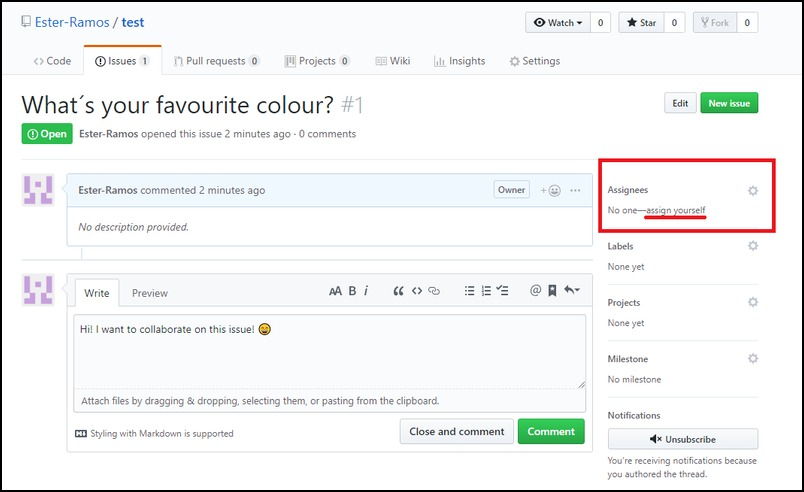
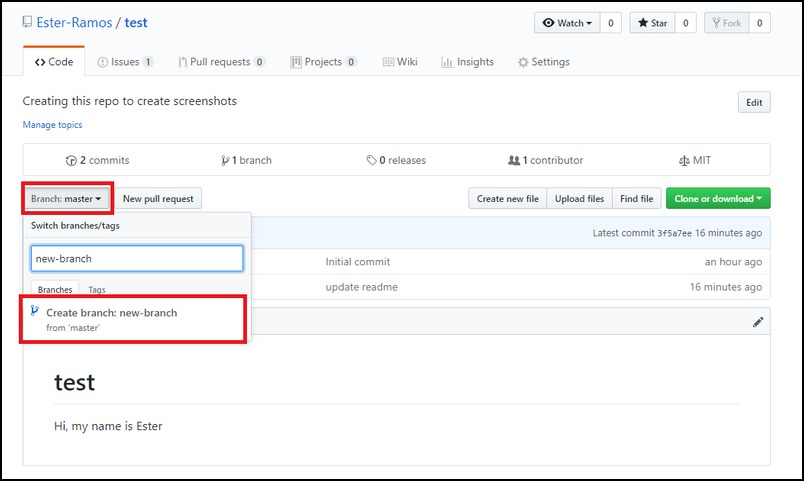

# Responding to issues (everyone)

7. Pick an issue to resolve, by assigning it to yourself and leaving a nice comment telling others you'll own it.

8. Create a branch to address your assigned issue.

9. Create a folder and file (with path instructions)

10. Commit your new file to **your** branch (not `master`!).

