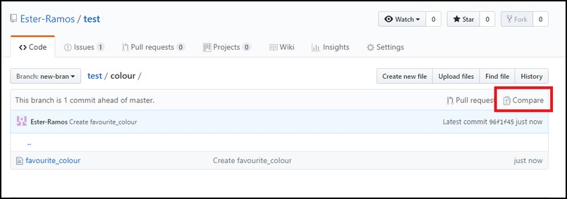
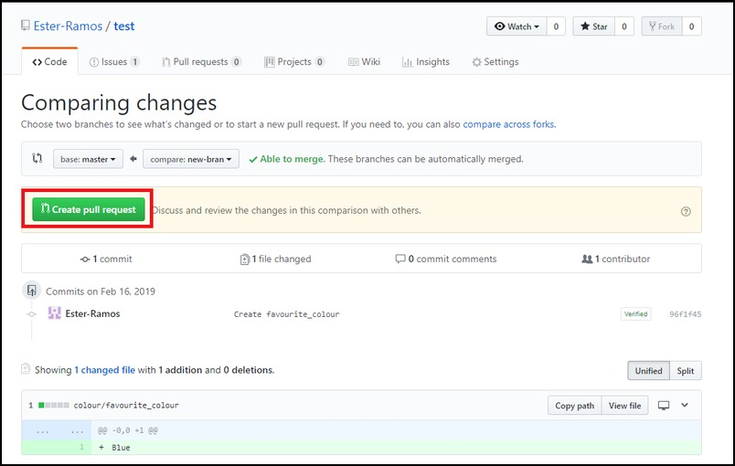
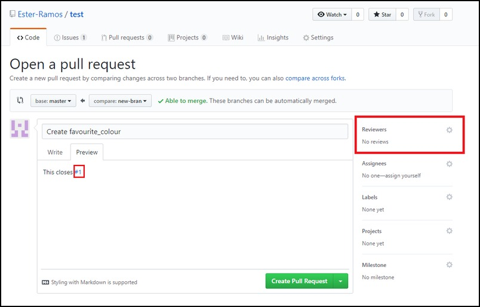

# Asking for a review (everyone)

11. Check the changes you have made in your own branch and make sure you have done everything you wanted.

Now open a pull request and add a comment linking to the issue in the pull request description.

Then use "Request a review" to add a teammate to examine your changes.

12. Time to catch-up. We'll take five minutes here to check that no one is lost.
