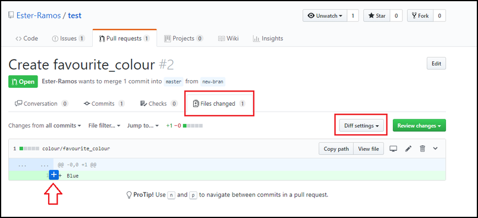
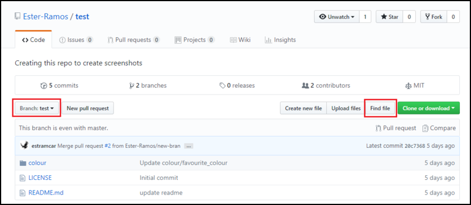

# Reviewing changes (everyone)

13. Look at the pull request you were assigned to review. View the file diff to see what was changed.

14. Add a comment on any line in the file and submit it with "Add a single comment".

15. If you want to see what else is in that branch go to the code and navigate the files.

16. Review the pull request. Add a general comment and request any changes you think are needed.

