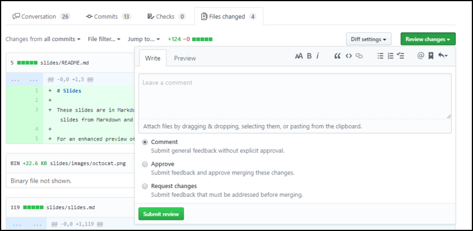
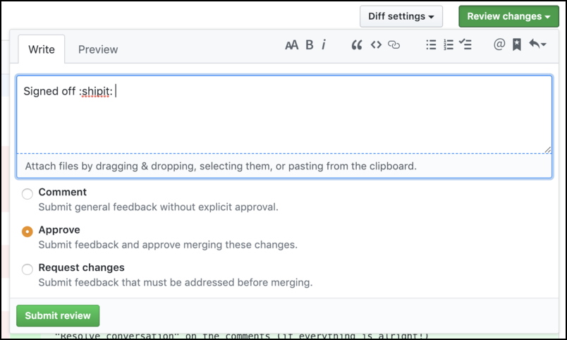

# Conducting a review (on someone else's PR) & Accepting a review (on your own PR)

13. Look at the pull request you were assigned to review. View the file diff to see what was changed.

14. Add a comment on any line in the file and submit it with "Add a single comment".

15. If you want to see what else is in that branch, go to the main repository page and navigate the files.

16. Finally, review the pull request.

Add a general comment and request any changes you think are needed.

Approve the pull request when you are happy with the changes made.

## Accepting a review
18. Return to your pull request and read any comments left by others on yours.
If no further changes are needed, click "Resolve conversation" on the comments
to close them.

