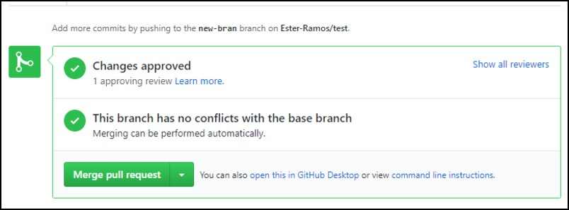

# Merging changes (everyone)
19. When your reviewers are happy with your changes, and there are no more
comments to address, you can merge your own branch into `master`. To do this,
click "Merge pull request"

